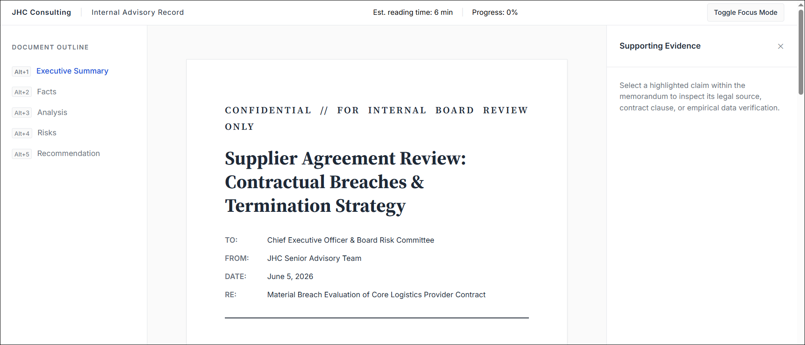

# Memorandum Interface

A distraction-free interface for reading, analyzing, and reviewing structured executive memoranda.

This project was developed as part of the application process for the Interface Developer Intern position at JHC Consulting. It explores how structured analytical documents can be presented in a digital environment without relying on external frameworks or introducing unnecessary interface complexity.

## Preview



## Purpose & Concept

JHC Consulting emphasizes structured written analysis over presentation-heavy formats, focusing on memoranda used in executive decision-making.

This interface is designed to reflect that approach by treating reading as a structured analytical process rather than passive content consumption.

The application simulates a memorandum organized into five sections:

1. Executive Summary
2. Facts
3. Analysis
4. Risks
5. Recommendation

Each section represents a logical component of a structured decision document.

---

## Technical Implementation

The project is built entirely using native web technologies without external UI frameworks.

- HTML5 (semantic document structure)
- CSS3 (layout, typography, responsive behavior)
- Vanilla JavaScript (interaction logic)

No frameworks or component libraries are used.

The goal is to demonstrate direct control over browser APIs and fundamental frontend architecture.

---

## Project Structure

```text
memorandum-interface/
├── index.html
├── README.md
├── css/
│   ├── reset.css
│   ├── variables.css
│   ├── layout.css
│   ├── typography.css
│   ├── components.css
│   └── responsive.css
├── js/
│   ├── app.js
│   ├── navigation.js
│   ├── annotations.js
│   ├── reading-mode.js
│   └── accessibility.js
└── data/
    └── memo.json

```

## Key Features

### Document Navigation

A persistent outline allows navigation between sections. Active section tracking is handled using the Intersection Observer API.

### Evidence Inspection

Selected statements in the document can be linked to supporting evidence stored in a structured JSON file. These are displayed in a dedicated side panel.

### Focus Mode

Removes secondary interface elements and presents the document in a single-column reading layout.

### Keyboard Navigation

Section navigation is supported via keyboard shortcuts:

- Alt + 1 ➔ Executive Summary
- Alt + 2 ➔ Facts
- Alt + 3 ➔ Analysis
- Alt + 4 ➔ Risks
- Alt + 5 ➔ Recommendation

### Print Layout

The interface includes print-specific styling to generate clean, archive-ready document output.

---

## Design Approach

The interface is guided by three principles:

### Clarity over decoration

Visual design supports readability and reduces cognitive load.

### Structure over presentation

Information hierarchy is emphasized over visual effects.

### Evidence over assumption

Analytical claims can be traced to supporting references.

---

## Intent

This project was created to reflect the design and development principles described in the JHC Consulting Interface Developer Intern role. It focuses on structured reading experiences, logical document flow, and minimal interface interference.

---

## License

This project is intended as a technical demonstration for a job application and portfolio submission.

```

```
